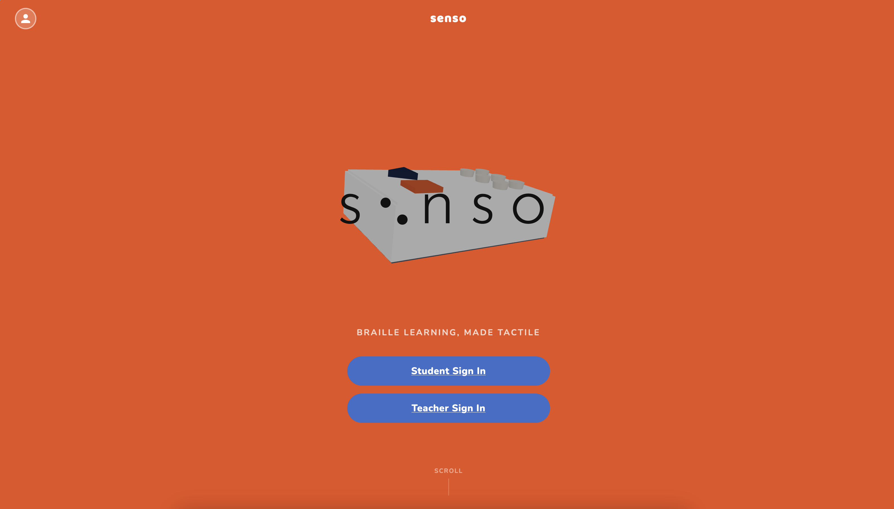
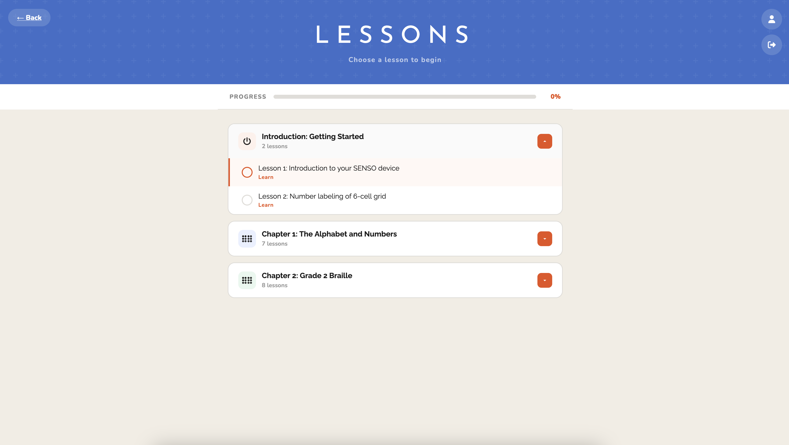
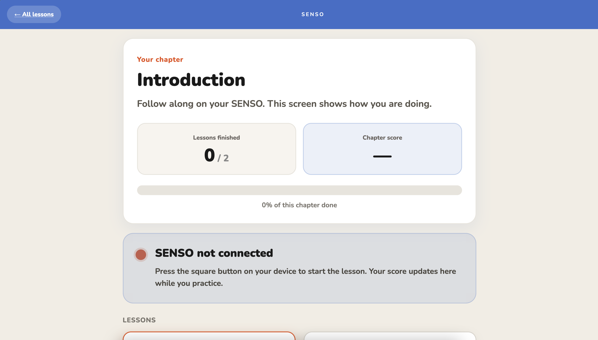
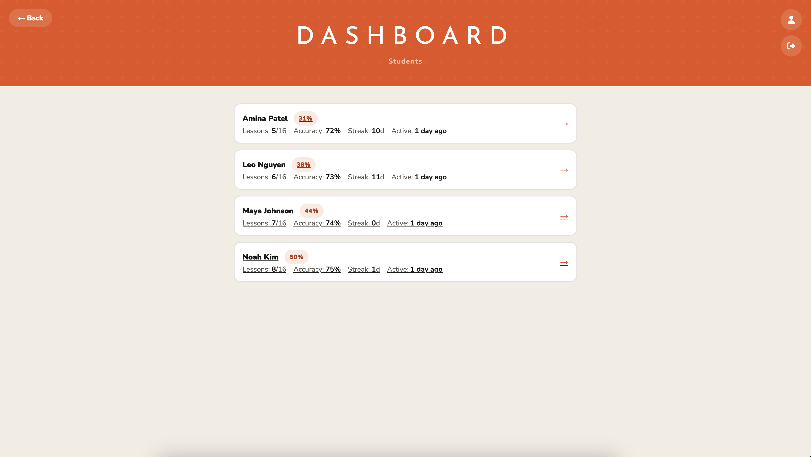
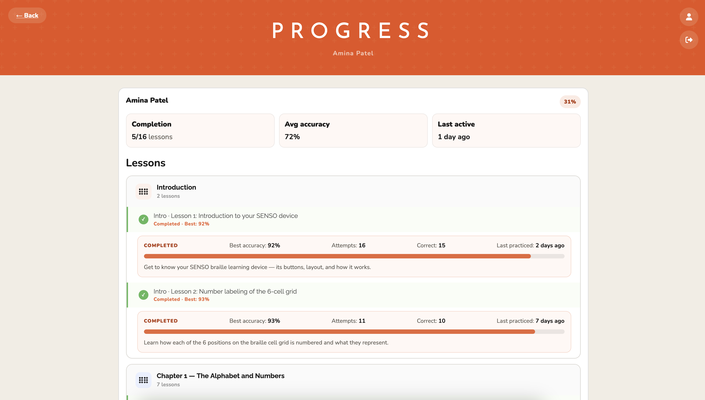

<p align="center">
  
</p>

<h1 align="center">SENSO</h1>

<p align="center">
  <strong>Accessible braille learning — tactile hardware, guided lessons, and educational dashboards.</strong>
</p>

<p align="center">
  <a href="https://github.com/g35k/senso">Repository</a> ·
  <strong>1st Place — Open Innovation</strong> · Hornet Hacks 4.0
</p>

---

## About

**SENSO** connects a Raspberry Pi tactile input device, Python lesson logic, a Flask API, and a React web app into one braille-learning flow. Learners practice on a six-dot cell with audio-led instruction; the web app provides chapter structure, lesson tracking, and accuracy feedback.

Built in 48 hours at Hornet Hacks 4.0, SENSO is now in **Version 2**: a **post-hackathon**, **pre-production** iteration with role-based auth, structured curriculum, and student/teacher dashboards. Some dashboard and analytics features are **scaffolded** while persistence and backend integration are completed.

**Accessibility** is core: tactile-first input, on-device audio, and a web layer for structure—not sighted-only interaction.

---

## Version 2 — What Changed

Version 1 proved hardware and browser could stay in sync during live practice. Version 2 turns that into a teachable, trackable system.

| Area | Version 1 (hackathon) | Version 2 (current direction) |
|------|------------------------|-------------------------------|
| **Frontend** | Single-flow lesson UI | React Router app: home, auth, lessons, lesson detail, profile, teacher dashboard |
| **Lessons** | Basic lesson pages | Chapter-based curriculum, lesson browser, per-chapter summaries |
| **Progress** | Device-local state | Client-side completion/accuracy; lesson views poll Pi `GET /state` for live scores |
| **Accounts** | None | Supabase Auth — student / teacher roles, signup, password reset |
| **Data model** | `user_state.json` on Pi | Supabase schema: profiles, students, teachers, sessions, assigned lessons (sync in progress) |
| **API** | Flask bridge | `new_api.py` — `GET /state`, `POST /press`, `POST /next` + CORS |
| **Operations** | Ad-hoc scripts | Example `systemd` unit for Pi Flask API |

**Curriculum:** Introduction (device + cell numbering) → Chapter 1 (alphabet, numbers) → Chapter 2 (punctuation/symbols).

---

## Features

- **Hardware** — GPIO tactile switches (6-dot cell), submit/nav buttons, USB speaker, optional vibration (`vibration.py`)
- **Pi runtime** — Menu-driven lessons (`braille.py` / `new_api.py`); intro, letters, numbers, practice; Optional TTS via ElevenLabs
- **Flask bridge** — Device state exposed to the browser; configurable Pi URL in `piApi.js`
- **Web app** — Student lessons + lesson detail with chapter analytics; role-gated auth; teacher dashboard UI; `/pi` route for API debugging
- **Supabase** — Auth, profiles, RLS; schema for rosters, sessions, and assigned lessons; local seed data

---

## Tech Stack

| Layer | Technologies |
|-------|----------------|
| **Frontend** | React 19, Vite, React Router |
| **Auth & data** | Supabase (Auth, Postgres, RLS) |
| **Device API** | Python 3, Flask, Flask-CORS |
| **Hardware** | Raspberry Pi, GPIO (`gpiozero`), pygame |
| **TTS** | ElevenLabs (optional) |
| **Tooling** | ESLint, Supabase CLI, `systemd` example |

---

## System Architecture

Each layer is developed and tested separately, then integrated for classroom or home use.

```text
┌─────────────────────────────────────────────────────────────────┐
│                     Web app (React + Vite)                       │
│  Auth · Lessons · Lesson detail · Profile · Teacher dashboard   │
└────────────────────────────┬────────────────────────────────────┘
                             │ HTTPS (Supabase)     HTTP (LAN/tunnel)
                             ▼                      ▼
┌──────────────────────────────┐    ┌──────────────────────────────┐
│   Supabase (Auth + Postgres)  │    │   Flask API (new_api.py)      │
│   profiles · students ·       │    │   GET /state · POST /press    │
│   teachers · sessions ·       │    │   POST /next · CORS           │
│   assigned_lesson             │    └──────────────┬───────────────┘
└──────────────────────────────┘                   │
                                                   │ GPIO / threads
                                                   ▼
                              ┌──────────────────────────────────────┐
                              │  Raspberry Pi lesson runtime          │
                              │  Button input · audio · lesson state  │
                              └──────────────────────────────────────┘
```

**Practice flow:** lesson on device → GPIO input → Python validation + audio → Flask `/state` → browser polls and updates chapter/lesson stats → (roadmap) sessions persist to Supabase for teachers.

```text
senso/
├── src/                 # React app
├── braille-hardware/    # Pi logic, Flask API, audio
├── supabase/            # Migrations, seed
├── scripts/             # Pi tunnel, systemd example
└── backend/             # Optional Next.js scaffold (not required to run main app)
```

---

## Student & Teacher Dashboards

**Students** browse chapters, open lesson detail for chapter-level completion and accuracy, and see Pi connection status during practice. Progress is tracked in the browser today; Supabase sync is on the roadmap.

**Teachers** get a dashboard for class overview and expanded per-student detail (see screenshots). The UI and database model (rosters, assignments, sessions) are in place; deeper analytics and full cloud persistence are **actively developed**.

---

## Accessibility Goals

- **Tactile-first** practice without relying on typing or precise pointer control  
- **Audio-led** instruction on the device  
- **Immediate feedback** — sounds, completion, accuracy  
- **Web as secondary** — structure and analytics, not the only learning channel  
- **Semantic HTML** where implemented (`role`, `aria-label`, `aria-expanded`)

Roadmap: voice customization, screen-reader-tested flows, pronunciation practice (not shipped yet).

---

## Challenges Encountered

- **First hardware build for the team** — GPIO, debouncing, and enclosure under a 48-hour deadline  
- **Pi ↔ browser sync** — LAN reliability, polling, and on-device state so the UI feels live  
- **Demo reliability** — Hornet Hacks Wi‑Fi blocked on-site Pi demo; remote operation over Discord led to tunnels, `systemd`, and clearer API boundaries  
- **Split runtimes** — Low-latency lessons on the Pi; accounts and classroom data in Supabase — integration is ongoing  
- **Scoped v2 delivery** — Dashboards and analytics scaffolded without overstating production readiness  

---

## Lessons Learned

- **Systems thinking beats feature lists** — The contract between GPIO, Python state, Flask JSON, and React matters more than any single screen  
- **Accessibility is architectural** — Audio, tactile input, and progress visibility belong in the design from the start  
- **Cross-disciplinary alignment** — Hardware layout, API shape, and lesson copy had to stay in sync across six roles  
- **Ship the bridge early** — A small Flask API (`/state`, `/press`, `/next`) unblocked the frontend before Supabase was complete  
- **Operational docs matter** — Seed data and recoverable Pi services matter as much as demo-day wins  

---

## Future Roadmap

- [ ] Sync Pi/web session data to Supabase  
- [ ] Teacher dashboard: assignments, per-student trends  
- [ ] Student profile tied to stored stats  
- [ ] Multi-cell display, richer practice modes  
- [ ] Voice options, pronunciation checking  
- [ ] Enclosure/STL aligned to final GPIO layout  
- [ ] Expanded curriculum, hardware setup guide  

---

## Screenshots & Demo

Captures in [`docs/screenshots/`](docs/screenshots/).

### Student portal

| | |
|:---:|:---:|
|  |  |
| *Home / onboarding* | *Lessons — chapter list and progress* |

| |
|:---:|
|  |
| *Lesson detail — chapter scores and per-lesson progress* |

### Teacher portal

| | |
|:---:|:---:|
|  |  |
| *Class overview — roster and lesson completion* | *Expanded student view — per-lesson accuracy and practice history* |

### Hackathon demo (Version 1)


---

## Setup

**Prerequisites:** Node.js 18+, Python 3.10+, Supabase project (for auth), Raspberry Pi + GPIO wiring (for full hardware), optional `ELEVENLABS_API_KEY`.

### Frontend

```bash
git clone https://github.com/g35k/senso.git && cd senso
npm install && cp .env.example .env
# VITE_SUPABASE_URL, VITE_SUPABASE_ANON_KEY — see .env.example for redirect URLs
npm run dev
```

### Supabase

```bash
supabase start          # optional local stack
supabase db reset       # migrations + seed (supabase/seed.sql)
```

### Flask API (Mac or Pi)

```bash
cd braille-hardware && python3 -m venv .venv && source .venv/bin/activate
pip install -r requirements-api.txt
# Pi only: pip install -r requirements-api-pi.txt
export SENSO_MODE=api PORT=5001
python new_api.py --api
```

Point the web app at your Pi (e.g. `http://192.168.1.10:5001`) in lesson detail or `/pi`. Persistent service: `scripts/senso-flask-api.service`.

**Env vars:** `VITE_SUPABASE_*` (frontend), `ELEVENLABS_API_KEY` / `PORT` / `SENSO_MODE=api` (Pi).

**Optional:** `backend/` is a minimal Next.js scaffold — not needed to run the Vite app.

---

## Team

**Team Manta** — six-person cross-disciplinary build (hardware, Pi, UI/UX, backend, frontend, product).

| Name | Role |
|------|------|
| **Kayla Garibay** | Team Lead · Full-Stack Engineering · Product Integration |
| **Ankita Patwal** | Systems · Scripting · Raspberry Pi Logic |
| **Althaea Locano** | Hardware · Circuits |
| **Jenna Jimenez** | Lead UI/UX |
| **Indira Debbad** | Backend Engineering |
| **Shelby Faith Solana** | Frontend Engineering |

---

## Project status

SENSO is **actively developed**: tactile lessons and the Flask bridge work end-to-end; Version 2 adds auth, curriculum structure, and dashboard UI. Main integration work: cloud persistence and teacher analytics.

Issues and feedback: [GitHub](https://github.com/g35k/senso).

---

## License

See repository license file if present; otherwise contact maintainers for usage terms.
